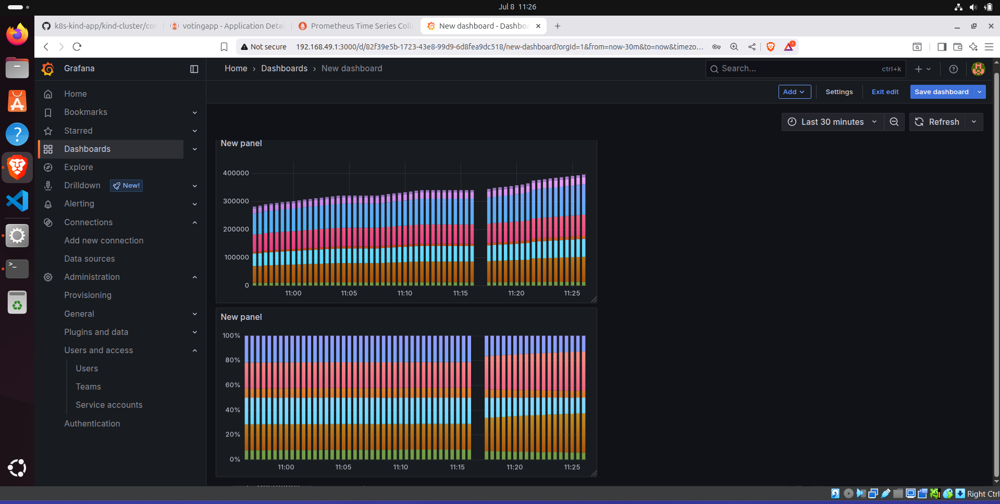
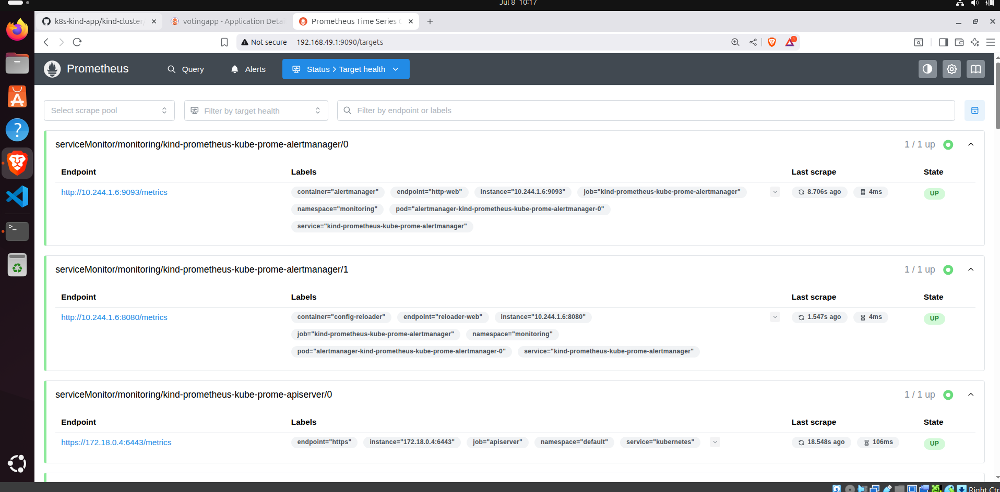
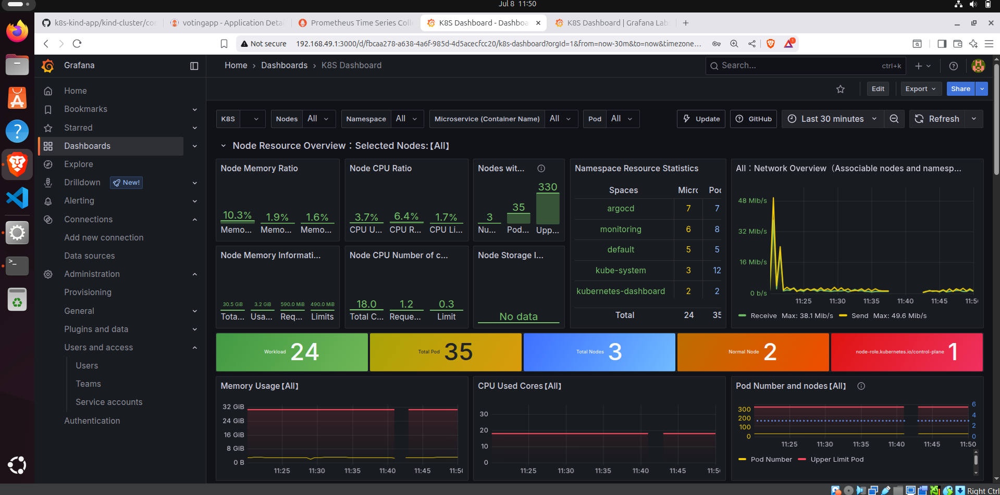

# 🚀 Kubernetes Monitoring with Prometheus & Grafana

This project demonstrates how I set up monitoring for a Kubernetes cluster using:

- 📦 **Prometheus** – for collecting metrics
- 📊 **Grafana** – for dashboard visualizations
- 🗳️ **Voting App** – My deployed sample application

All services are running in a local Kubernetes environment, and dashboards have been created to visualize cluster and application performance.

---

## 📸 Screenshots

| Grafana Dashboards | Prometheus Targets | Custom Monitoring |
|--------------------|--------------------|-------------------|
|  |  |  |

---

## 🧰 Stack Overview

- **Kubernetes (Kind)** – Local cluster setup
- **Prometheus** – Metrics collection
- **Grafana** – Visualization and custom dashboards
- **Node Exporter** – For node-level metrics
- **ArgoCD** – Used for GitOps-based deployment of the app

---

## 📊 What I Monitored

- Node CPU & Memory Usage
- Pod Restarts & Uptime
- Custom Dashboards for:
  - `votingapp` services
  - Kubernetes Nodes
  - Cluster Overview
- Prometheus Targets status
- Real-time resource graphs

---

## 🧠 Learning Outcomes

- Understood how monitoring works in Kubernetes
- Created multiple dashboards to track system and app performance
- Explored Prometheus queries (PromQL) and Grafana visualization features

---

